*This repository contains a project of SA2 for the realization of a weather station during my engineering school* \
*Converted from tex file, pdf in the repository*

# Rapport de projet - *Station météo*

# Proteus

## Schéma


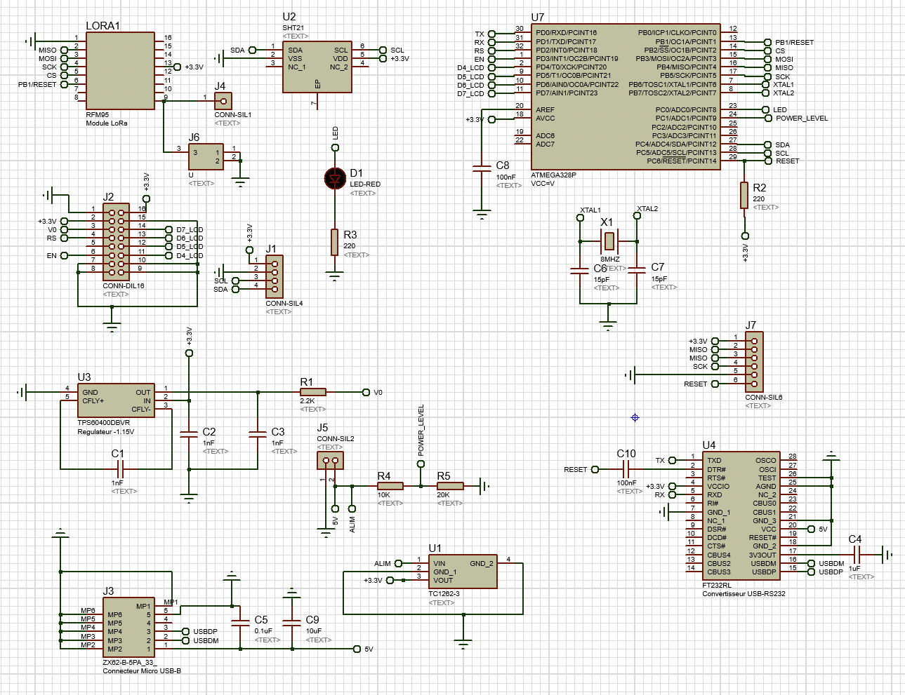


Pour la réalisation de la carte capteur, nous avons dans un premier
temps récupéré l'ensemble des empreintes des composants. Pour certains,
comme le module LORA, il a fallu réaliser son empreinte (schématique et
routage) à partir des données de la datasheet.\
Une fois les éléments rassemblés sur la feuille du schéma par groupe de
fonction (Puissance, capteur, ATMEGA...), nous avons repris les
datasheets des différents composants afin de définir les liaisons entre
eux.

## Routage


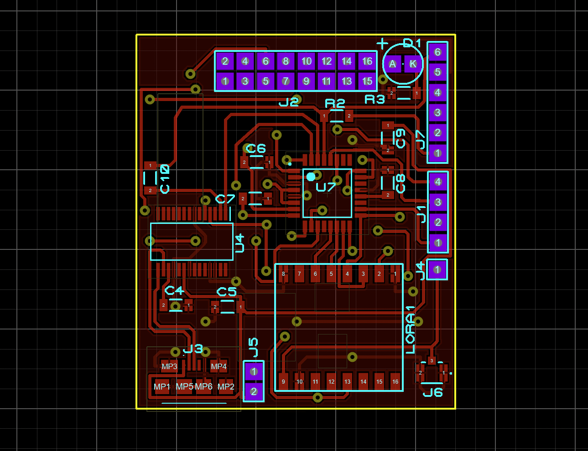


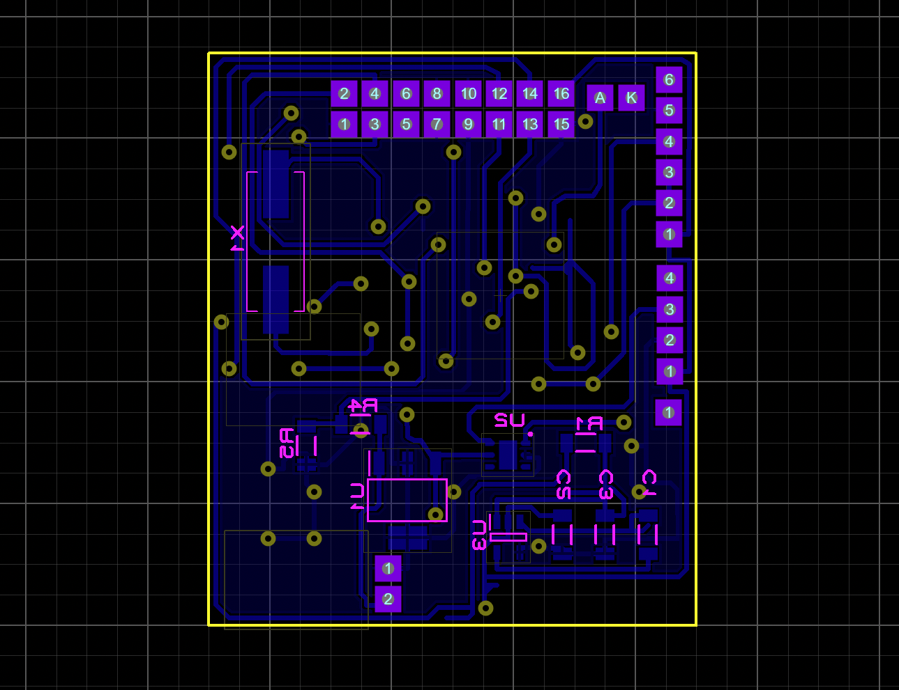


Pour le routage, nous avons fais le choix de grouper nos composants de
manière cohérente selon leur fonction. Cela nous a permis de réaliser un
routage automatique sans avoir d'erreur. Cependant le routage restait
mal optimisé et nous avons donc repris un certain nombre de pistes afin
de corriger les angles, limiter le nombre de via et vérifier leur
placement sous les composants.\
Malheureusement, quelques détails nous ont échappé. L'empreinte du
quartz n'était pas la bonne et le placement du LCD n'était pas optimal.
Nous avons donc dû recommencer la démarche : Routage
auto/Modification/Vérification.

## Plan 3D


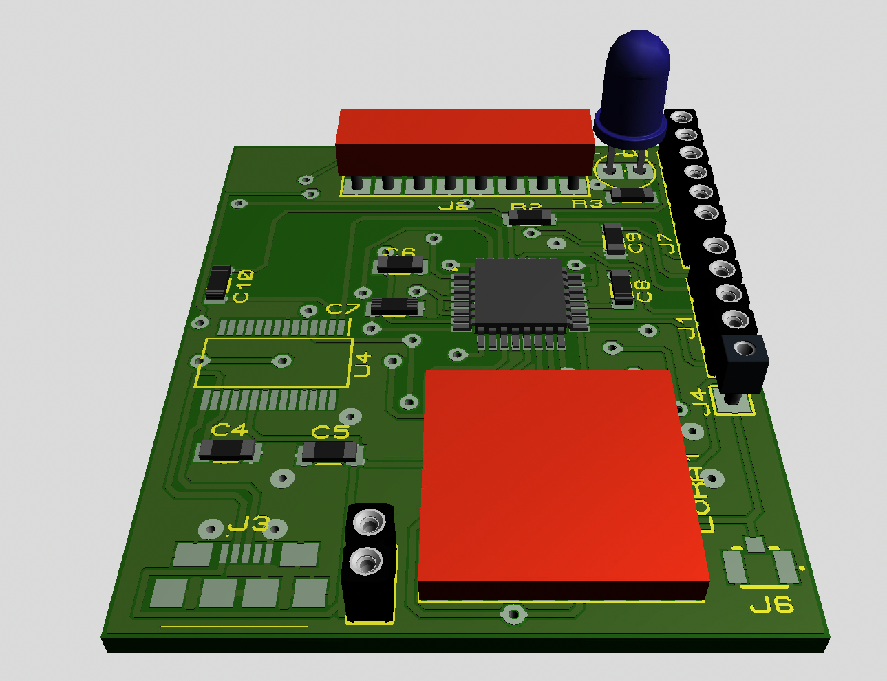

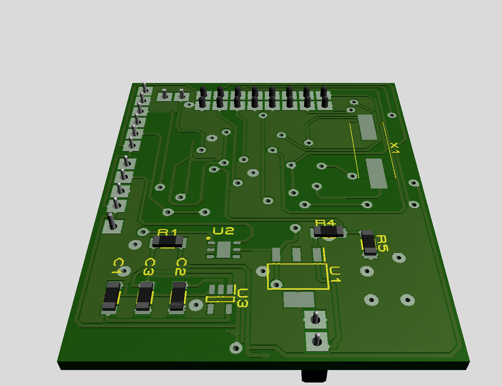


# Codes

Nous avons décidé de réaliser les codes dans un projet *PlatformIo* pour
des raisons de confort. Le logiciel *Arduino IDE* est très limité, par
exemple il n'y a pas d'autocomplétion ou d'indications directes sur des
erreurs de syntaxe. Alors que sur un projet *PlatformIo* on peut
directement utiliser des IDE comme *VSCode* ou encore *CLion* et donc
bénéficier de tous leurs avantages.\
Cependant, si vous compilez le projet directement, ça ne fonctionnera
pas. Il est nécessaire de modifier les *includePath* ou alors recréer le
projet et copier les codes qui se trouvent dans le répertoire suivant :

1.  Code de la carte capteur $\to$
    *Arduino/code/projet_platformio/sensor_board/src/main.cpp*

2.  Lib de la carte capteur $\to$
    *Arduino/code/projet_platformio/sensor_board/lib/\...*

3.  Code de la carte serveur $\to$
    *ESP_code/projet_platformio/server_board/src/main.cpp*

4.  Lib de la carte serveur $\to$
    *ESP_code/projet_platformio/server_board/lib/\...*

Sinon il est également possible d'utiliser nos codes directement dans le
logiciel *Arduino IDE* en utilisant les fichiers suivants et en
important les librairies au format .zip :

1.  Code de la carte capteur $\to$
    *Arduino/code/projet_arduino_ide/main/main.ino*

2.  Lib de la carte capteur $\to$
    *Arduino/code/projet_arduino_ide/\*.zip*

3.  Code de la carte serveur $\to$
    *ESP_code/projet_arduino_ide/main/main.ino*

4.  Lib de la carte serveur $\to$
    *ESP_code/projet_arduino_ide/\*.zip*

Nous avons également maintenu un dépôt *git* pendant la réalisation des
codes, le *.git* est dans le zip.


## Carte capteur

### L'architecture du code

Pour la mise en œuvre de la carte capteur, nous avons décidé de
décomposer le code en plusieurs fichiers comme on peut le voir. Cela nous permet de garder un code propre
sans mélanger les fonctionnalités des différents capteurs.


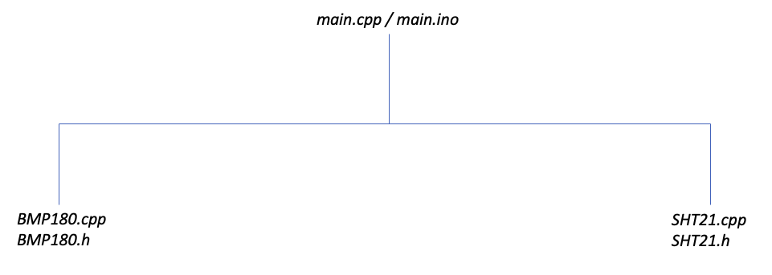


### Programmation du BMP180

#### Les fonctions

Le BMP180 est décomposé en plusieurs fonctions. Les fonctions
principales sont publiques et elles permettent d'obtenir la pression et
d'initialiser le capteur à partir du *main*. L'initialisation consiste à
lire les paramètres de compensations et à initialiser la liaison *I2C*.

```c
long getPressure(); // retourne la pression en long
void begin(); // Lecture des paramètres de compensation
```

Il y a ensuite les fonctions privées qui permettent d'obtenir la
pression brute sur 16 bits ou encore pour convertir cette pression brute
en *hPa*. Il n'y a donc aucune utilité pour l'utilisateur de les avoir
dans le *main.*

```c
int32_t readPressure(); // Lecture de la pression brut
int32_t readTemp(); // Lecture de la temp brut, utile pour le calcul de B5 uniquement
long convertRawPressure(int32_t rawPressure); // Convertion de la pression brut
int32_t read2SignedByte(int8_t addr); // Lecture de 2 octets signés
uint32_t read2UnsignedByte(int8_t addr); // Lecture de 2 octets non signés
```

L'une des particularités de la *datasheet* que nous n'avions pas très
bien compris. C'est qu'il est précisé que la lecture des registres de
température et de pression doit être affectée dans des variables de type
*short* soit 32 bits. Alors que nous lisons uniquement 16 bits. Nous
n'avons pas très bien compris l'utilité, mais comme cela fonctionne nous
avons gardé le type *short* pour respecter la *datasheet*.

#### Algorithme de la lib BMP180


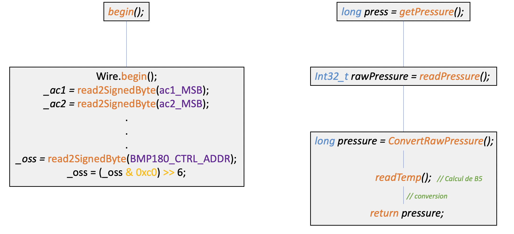


### Programmation du SHT21

#### Les fonctions

Le SHT21 est décomposé en plusieurs fonctions. Les fonctions principales
sont publiques et elles permettent d'obtenir la température, l'humidité
et d'initialiser la liaison *I2C* à partir du *main*.

```c
void begin(); // Initialise la liaison I2C
float getTemp(); // retourne la temp en float
float getRH(); // retourne l'humidité en float
```

Il y a ensuite les fonctions privées qui permettent d'obtenir la
température brute et l'humidité brute sur 16 bits ou encore pour
convertir les mesures brutes en valeurs normalisées. Il n'y a donc
aucune utilité pour l'utilisateur de les avoir dans le *main.*

```c
uint16_t readTemp(); // retourne la temp brut sur 16bits
uint16_t readRH(); // retourne l'humidité brut sur 16bits
float convertRawTemp(uint16_t rawTemp); // Conversion de la temp brut en float
float convertRawRH(uint16_t rawRH); // Conversion de l'humidite brut en float 
```

#### Algorithme de la lib SHT21


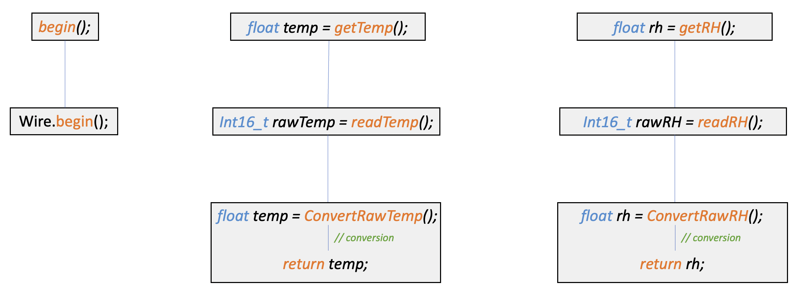


### Mise en œuvre de Lora

Nous n'avons pas eu le temps de tester notre code pour la mise en œuvre
d'une communication Lora, c'est la raison pour laquelle il est présent,
mais commenté pour éviter tous les problèmes.\
Comme c'est un code pas très conséquent, nous avons choisi de ne pas
réaliser de fichiers séparés et de le mettre directement dans le
*main*.\

```c
SPI.begin(); // intialisation des pins
LoRa.setPins(); // intialisation des pins

unsigned int myDelay = millis();

int ret = 0;
while ((myDelay + 10000) > millis()){ // delai de 10sec pour établir la communication Lora
    ret = LoRa.begin(LORA_FREQUENCY);

    if (ret){
    Serial.println("Starting LoRa success!");
    LoRa.setSyncWord(0xa2);
    break;
    }
}

if (!ret){ // gestion d'err
    Serial.println("Starting LoRa failed!");
}
```

```c
void loraSendData(float temp, float rh, long press)
{
    LoRa.beginPacket();
    LoRa.print(temp);
    LoRa.print(rh);
    LoRa.print(press);
    LoRa.endPacket();
}
```

### Le programme principal (main)

Le *main* est comme son nom l'indique le fichier principal de notre
code. En déclarant des objets liés aux classes des librairies
précédemment décrites, nous allons pouvoir afficher les différentes
mesures.\
Il faut dans un premier temps inclure nos librairies puis déclarer les
objets :

```c
// Librairies de base de arduino
#include <Arduino.h>
#include <LiquidCrystal.h>
#include <Wire.h>
#include <LoRa.h>

// Librairies faites par nous-meme pour utiliser les capteurs de la carte serveur
#include <sht21.h>
#include <bmp180.h>

// Declaration des objets des classes
LiquidCrystal lcd(rs, en, d4, d5, d6, d7);
BMP180 bmp;
SHT21 sht;
```

Initialisation des différents capteurs et du wifi :

```c
lcd.begin(16, 2);
bmp.begin();
sht.begin();
Serial.begin(9600);
```

Suite à ces déclarations, on peut utiliser les objets pour obtenir les
différentes mesures :

```c
float temp = sht.getTemp();
```

Comme on peut le constater avec cet exemple. Le choix d'avoir fait une
classe par capteur, nous permet de structurer plus facilement notre code
et de garder code un propre et facile à comprendre.\

#### Algorithme de notre code


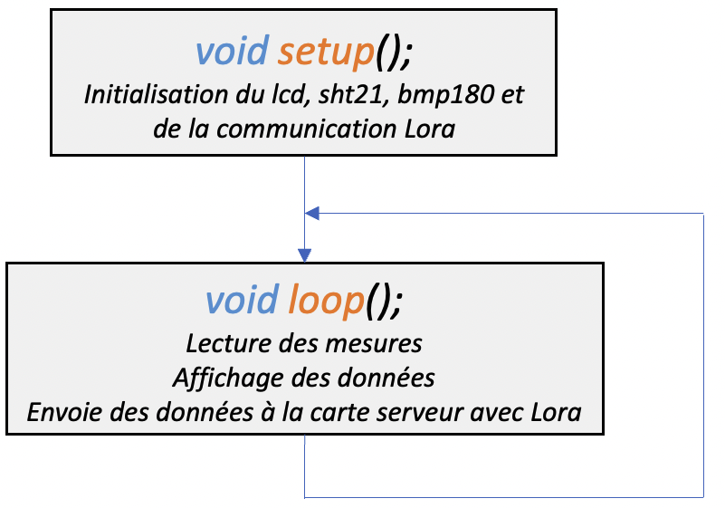


### Simulation et test sur carte

#### Simulation

Comme nous pouvons le constater sur la figure, la première ligne correspond aux valeurs
du *SHT21* et la seconde aux valeurs du *BMP180*. Les mesures de la
première ligne sont cohérentes, mais pas sur la seconde. La température
est bonne contrairement à la pression. Plusieurs de nos camarades
avaient également ce problème, il est donc possible de se demander si
l'erreur ne viendrait pas de la simulation plutôt que de notre code.


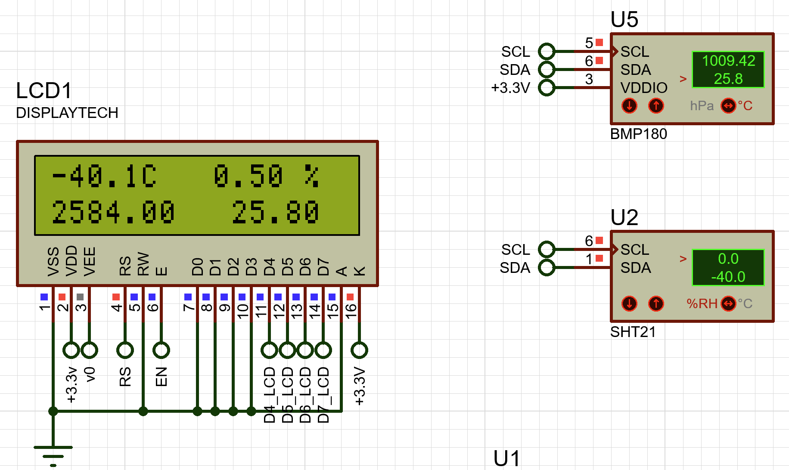


#### Tests sur carte

Maintenant que le programme de la carte capteur terminé, il est
nécessaire de le téléverser sur cible. Pour cela, il faut dans un
premier temps implémenter un bootloader. Il permet de téléverser et
exécuter nos programmes arduino. Lors de son implémentation, nous nous
sommes rendu compte d'une erreur sur le schéma. Le connecteur J7 du
bootloader est connecté à deux pins MISO au lieu de 1 pin MISO et 1 pin
MOSI.\
Pour charger le bootloader il a donc fallu couper une piste et ressouder
des fils :

1.  Entre le Pin 2 du J7 et 3 du module LORA

2.  Entre le Pin 3 du J7 et 2 du module LORA

Ensuite, nous avons téléversé un premier code de test qui fait
simplement clignoter la LED de la carte capteur. L'exécution est
correcte, nous pouvons donc téléverser le programme principal. Mais le
programme ne se téléverse pas. Nous avons alors essayé de comprendre le
problème en procédant par élimination.\
Vérifier dans un premier temps le code. Pour cela, nous l'avons
téléversé sur une autre carte capteur de nos camarades. Le programme se
téléverse bien sur leur carte, mais toujours pas sur la nôtre. De même,
le code pour faire clignoter la LED ne se téléverse pas non plus. Ce
n'est donc pas un problème d'ordinateur, de compilation ou de câble et
port USB.\
Le problème logiciel semblait écarté. Nous avons donc vérifié la carte
en passant celle-ci au peigne fin de la loupe, mais aucune trace de
cours circuits. En vérifiant les tensions de la carte, l'ensemble des
composants étaient correctement alimentés.\
À ce stade-là, nous étions quasi certains d'avoir un code bon et une
carte fonctionnelle. Puisque c'est le bootloader qui permet de charger
le programme et que c'est justement ce que nous n'arrivons pas à faire,
nous avons décidé de recharger le bootloader avec monsieur BERTHOLOM.\
Après plusieurs tentatives échouées suite à un mauvais câblage et
différents tests effectués, nous avons finalement réussi à recharger le
bootloader. Le test du code pour faire clignoter la LED fonctionne, mais
en voulant téléverser notre programme principal, ECHEC. Une nouvelle
fois, nous avons pu charger un programme puis plus aucun. Nous avons
alors émis l'hypothèse que le programme venait écraser le bootloader et
que celui-ci ne pouvait donc plus charger de nouveaux programmes.\
Les manipulations ont été refaites plusieurs fois afin de vérifier les
vitesses de transmission, les signatures et enfin d'étudier les messages
d'erreurs. Nous avons pu mettre en lumière plusieurs points comme le
changement de signature selon la tension +3,3 V et +5 V. Grâce à ses
tests, monsieur BERTHOLOM a fait un fichier avec l'ensemble des erreurs
recensées.\
Par manque de temps pour plus d'investigations, nous sommes donc arrêtés
au point de pouvoir téléverser une seule fois notre programme. Comme le
module LORA nécessite d'être soudé après le chargement du bootloader,
nous n'avons pas pu vérifier notre code avec la fonction de transmission
LORA.

## Carte serveur

### L'architecture du code

Pour la mise en œuvre de la carte serveur, nous avons décidé de
décomposer le code en plusieurs fichiers comme on peut le voir sur la
figure. Cela nous permet de garder un code propre
sans mélanger les fonctionnalités des différents capteurs.


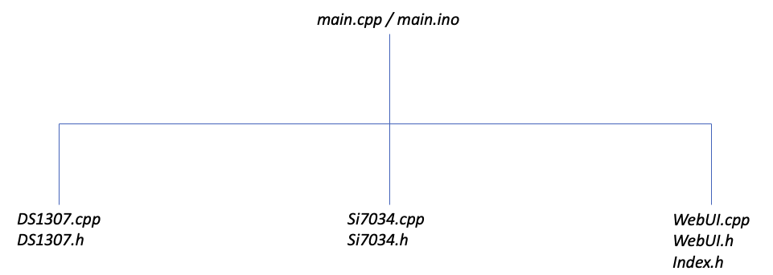


### Programmation du DS1307

#### Les fonctions

Le *DS1307* est décomposé en plusieurs fonctions. Les fonctions
principales sont publiques et elles permettent de configurer l'heure
actuelle grâce à un serveur ntp et la seconde permet d'obtenir l'heure
du *DS1307*.

```c
void begin(); // Initialise la liaison I2C
void setupRealTime(struct tm *time); // Configuration à partir du serveur ntp 
void getRealTime(struct MyTime *myTm); // Retourne une structure avec l'heure du RTC
```

Il y a ensuite les fonctions privées qui permettent de convertir un
*BCD* en décimal et inversement. Il n'y a donc aucune utilité pour
l'utilisateur de les avoir dans le *main.*

``` c
uint8_t decToBcd(uint8_t dec); // conversion decimal a bcd
uint8_t bcdToDec(uint8_t bcd); // conversion bcd a decimal
int actualYear(int yearsFrom1900); // conversion du temps ecoule depuis 1900
```

#### Le fonctionnement

Dans un premier temps, il est nécessaire de configurer le wifi avec un
*ssid* et un *password* définis au préalable. De nombreux exemples
existent sur internet, celui-ci en fait partie :

```c
WiFi.begin(ssid, password);
while(WiFi.waitForConnectResult() != WL_CONNECTED){      
    Serial.print(".");
}
Serial.println("");
Serial.print("Connected to ");
Serial.println(ssid);
Serial.print("IP address: ");
Serial.println(WiFi.localIP());  
```

Pour configurer le *DS1307* il faut procéder en plusieurs étapes :

1.  Synchronisation de l'ESP avec l'heure NTP, fonction *configTime()*
    de *esp32-hal-time.c*.

2.  Déclaration d'une instance de la structure *struct tm* déclaré dans
    lib *Time.h* de arduino.

3.  Obtention de l'heure actuelle avec *getLocalTime()* de
    *esp32-hal-time.c*, cette fonction doit prendre en paramètre
    l'adresse de l'instance de la structure *tm* précédemment créer pour
    que ses valeurs puissent être modifiées.

4.  Configuration du *DS1307* avec notre fonction *setupRealTime* située
    dans *DS1307.h*, cette fonction doit également prendre l'adresse de
    notre instance de la structure *tm* pour que ses valeurs puissent
    être utilisées.

    - Exemple 
  
    ```c
    DS1307 clk;

    configTime(0, 3600, ntpServer); // configuration du temps réel sur l'esp
                                    // depuis le serveur ntp
    struct tm rtm; // Structure déclaré dans la lib time.h de arduino

    if(getLocalTime(&rtm)){ // retourne l'heure du esp32 configuré avec le ntp
        clk.setupRealTime(&rtm); // configuration du DS1307
    }
    ```

Pour lire l'heure du *DS1307* il faut également procéder en plusieurs
étapes :

1.  Déclaration d'une instance de la structure *struct MyTime* déclarée
    dans notre lib *DS1307.h*.

2.  Appel de notre fonction *getRealTime()*, avec en paramètre l'adresse
    de l'instance de la structure *MyTime* précédemment créée pour que
    ses valeurs puissent être modifiées.

3.  Utilisation de l'instance de la structure *MyTime* pour lire les
    valeurs du *DS1307*.

Le fait que notre fonction a comme paramètre un pointeur permet de
modifier directement les valeurs de l'implémentation de notre structure
sans avoir besoin de créer une nouvelle à chaque fois ou de retourner
une structure. Cela permet une économie de mémoire et de performance.
Deplus il est beaucoup plus pratique d'utiliser une structure quand on a
autant de données à retourner, contrairement capteur de température et
d'humidité.

- Exemple 

```c
DS1307 clk;

struct MyTime myTime;
clk.getRealTime(&myTime);
int secondes = myTime.secondes;
```

Pour une meilleure compréhension du pourquoi, on doit donner en
paramètre l'adresse de notre structure. C'est dû au fait que dans notre
fonction *getRealTime* on affecte directement à nos différentes
variables de la structure les valeurs du *DS1307* :

- Exemple *(Extrait de notre fonction, elle n'est pas
complète ici !)*

```c
void DS1307::getRealTime(struct MyTime *myTm){
    // Wire.beginTran [...]
    myTm -> month = bcdToDec(Wire.read());
    // [...]
}
```

### Programmation du Si7034

#### Les fonctions

Le *Si7034* est décomposé en plusieurs fonctions. Les fonctions
principales sont publiques et elles permettent d'obtenir la température,
l'humidité et d'initialiser la liaison *I2C* à partir du *main*.

```c
void begin(); // Initialisation de la liaison I2C
float getTemp(); // Retourne la température en float
float getRH(); // Retourne l'humidité en float
```

Il y a ensuite les fonctions privées qui permettent d'obtenir la
température brute et l'humidité brute sur 16 bits ou encore pour
convertir les mesures brutes en valeurs normalisées. Il n'y a donc
aucune utilité pour l'utilisateur de les avoir dans le *main.*

```c
uint16_t readRawTemp(); // retourne la temp brut sur 16bits
uint16_t readRawRh(); // retourne l'humidité brut sur 16bits
float convertRawTemp(uint16_t rawTemp); // conversion de la temp brut en float
float convertRawRH(uint16_t rawRH); // conversion de l'humidité brut en float 
```

#### Algorithme de la lib Si7034


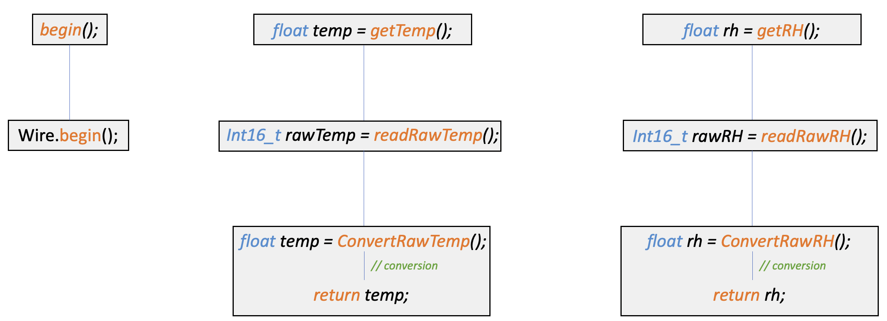


#### Problèmes rencontrés

dans la *datasheet* il est précisé que la trame pour une lecture des
registres de mesure doit ce comporter de la manière suivante :


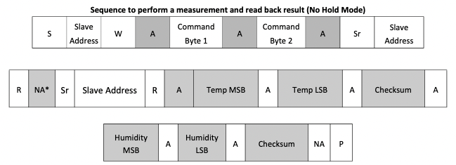


En respectant cette trame, la mesure des capteurs n'a pas fonctionné.
Après plusieurs recherches, nous avons trouvé un site internet,
expliquant la lecture de mesure d'une manière différente qui fonctionne.
C'est pourquoi nous l'avons utilisé et que notre code ne correspond pas
totalement à la trame de la *datasheet*. Cette méthode consiste à lire
les registres du capteur en deux fois plutôt qu'une.\


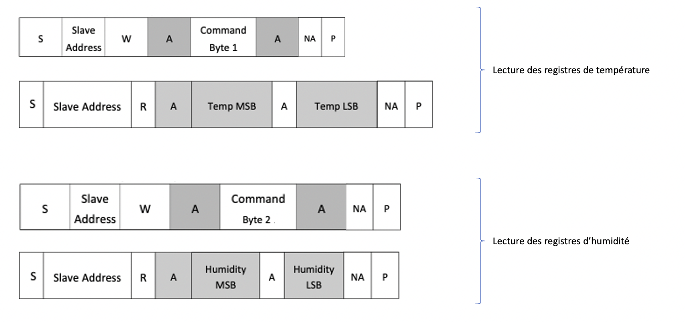


### Mise en œuvre de Lora

Nous n'avons pas eu le temps de tester notre code pour la mise en œuvre
d'une communication Lora, c'est la raison pour laquelle il est présent,
mais commenté pour éviter tous les problèmes.\
Comme c'est un code pas très conséquent, nous avons décidé de ne pas
réaliser de fichiers séparés et de le mettre directement dans le *main*.

```c
SPI.begin(SCK, MISO, MOSI, SS); // intialisation des pins
LoRa.setPins(SS, RESET, DIO0); // initialisation des pins

int myDelay = millis();

int ret = 0;
while ((myDelay + 10000) > millis()){ // delai de 10sec pour établir la communication Lora
    ret = LoRa.begin(LORA_FREQUENCY);

    if (ret){
    Serial.println("Starting LoRa success!");
    LoRa.setSyncWord(0xa2);
    break;
    }
}

if (!ret){ // gestion d'err
Serial.println("Starting LoRa failed!");
}
```

```c
void loraGetData(){
    int packetSize = LoRa.parsePacket();
    
    // Si des paquets sont à lire alors on les lis
    if (packetSize) {
        while (LoRa.available()) {
        outTemperature = LoRa.read();
        outHumidity = LoRa.read();
        outPressure = LoRa.read();
        }
    }
}
```

### Mise en œuvre du serveur Web


Le rendu final de notre interface web *(voir figure)*, intègre
les valeurs réelles du *SI7034* et *DS1307*. Nous n'avons pas pu tester
notre code Lora comme expliqué plus tôt, les mesures extérieures sont
donc de fausses valeurs.

#### Les fonctions

L'interface web qui porte comme nom de classe *WEBUI* est décomposée en
plusieurs fonctions :

```c
void begin(); // Initialisation du serveur web et des événements pour les requettes AJAX
void displayValue(); // affichage des valeurs sur l'interface web
// Configuration des valeurs pour les afficher sur l'interface :
void setValue(float *inTemp, float *inRh, float *outTemp, float *outRh, long *Press, struct MyTime *myTm);
```

Il y a ensuite les fonctions qui permettent de réaliser les événements
des requêtes *AJAX* qui sont en lien avec le serveur web et
l'interface web pour permettre l'affichage des données :

```c
void handleRoot(); // Permet l'affichage de la page principale
void handleInTemp(); // Permet l'affichage de la temp intérieur
void handleInRh(); // Permet l'affichage de l'humidité intérieur
void handleOutTemp();
void handleOutRh();
void handlePress();
void handleDay();
void handleMonth();
void handleYear();
void handleHour();
void handleMin();
void handleSec();
```

#### Le fonctionnement


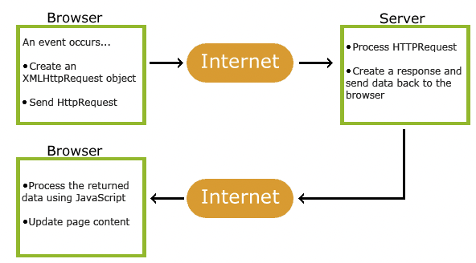


La figure,
décrit parfaitement le fonctionnement du protocole *AJAX*. Notre
interface web va envoyer des requêtes de lecture au serveur à un certain
intervalle, puis le serveur va répondre avec une requête d'écriture au
site web. Ensuite, l'interface web va s'occuper de réceptionner les
valeurs puis de les afficher.\

- Exemple avec la température

    Dans un premier temps, il faut créer l'événement et indiquer quelle
    fonction qu'il doit réaliser lorsqu'il arrive. Si le serveur reçoit une
    requête avec pour *id : readIndoorTemp*, il devra réaliser la fonction
    *handleInTemp()* :

    ```java
    server.on("/", handleRoot); // Création de l'évenement pour charger la page html
    server.on("/readIndoorTemp", handleInTemp); // Création de l'évenement pour charger la temp intérieur
    ```

Ensuite, la seconde partie du code est située dans la page html,
*index.h*. Il permet de faire le lien entre l'interface web et le
serveur. Une requête est faite et si le serveur répond avec la valeur,
on l'affiche sur l'interface web. On remarquera qu'a l'appel de la
fonction *xhttp.open()*, l'*id* correspond à celui de la fonction
*server.on* du code précédent.

```java
setInterval(function() {
    getIndoorTemp();
}, 1000);  // Appel de la fonction getIndoorTemp toute les secondes

function getIndoorTemp() {
    var xhttp = new XMLHttpRequest(); // Création d'une nouvelle requête
    xhttp.onreadystatechange = function() {
        if (this.readyState == 4 && this.status == 200) {
            document.getElementById("indoorTemp").innerHTML = this.responseText; // On précise à qu'elle endroit on doit afficher la valeure
        }
    };
    xhttp.open("GET", "readIndoorTemp", true); 
    xhttp.send(); // On envoie la requête
}
```

Comme on a initialisé l'événement sur le serveur, et que l'interface web
a envoyé une requête à l'*id readIndoorTemp*. Le serveur doit réaliser
la fonction *handleInTemp()*, ce qui permet d'envoyer la température
intérieure à l'interface web et de l'afficher :

```c
// Permet de charger la température intérieur
void handleInTemp()
{
    String Value = String(*inTemp); // récupère sous forme de string la temp
    server.send(200, "text/plane", Value); // envoie une requette d'écriture au serveur web
}
```

#### Problèmes rencontrés

La réalisation d'un serveur web avec une interface web dynamique était
une nouveauté pour nous. Après avoir réalisé plusieurs recherches sur la
méthode la plus adaptée, nous avons opté pour le protocole *AJAX*.
L'avantage pour nous était d'avoir le code *html* dans un autre fichier
(*index.h*) et de réaliser la communication entre le serveur et
l'interface avec de simples requêtes. Cette méthode nous permettait
encore une fois de garder un code propre, avoir du *html* dans un
fichier *.c/.cpp* n'était pas très adéquate selon nous.\
Cependant, le fait de ne pas connaitre ce protocole nous a posé quelques
problèmes, l'affichage des données ne se fait pas de manière synchrone.
Même si les requêtes sont réalisées toutes les secondes, il n'y avait
qu'une valeur qui se mettait à jour. Augmenter le délai entre chaque
requête rend l'affichage plus agréable, mais c'est le navigateur qui
finissait par buger dû aux nombreuses requêtes.\
Il est évident qu'une amélioration est possible, mais par manque de
temps nous n'avons pas pu résoudre cette latence.

### Le programme principal (main)

Le *main* est comme son nom l'indique le fichier principal de notre
code. En déclarant des objets liés aux classes des librairies
précédemment décrites, nous allons pouvoir afficher les différentes
mesures.\
Il faut dans un premier temps inclure nos librairies puis déclarer les
objets :

```c
// Librairies arduino de base
#include <Arduino.h>
#include <LiquidCrystal.h>
#include <Wire.h>
#include <WiFi.h>
#include <LoRa.h>
#include <SPI.h>

// Librairies faite par nous-même pour utiliser les capteurs de la carte serveur
#include <ds1307.h>
#include <si7034.h>
#include <webui.h>
```

```c
// Déclaration des constantes
const char* ssid = ""; // MODIFER !!
const char* password =  ""; // MODIFIER !!
const char* ntpServer = "time.google.com";

const int rs = 15, en = 2, d4 = 0, d5 = 4, d6 = 16, d7 = 17; 

// Déclaration des objets de classes
LiquidCrystal lcd(rs, en, d4, d5, d6, d7);

DS1307 clk;
SI7034 sensor;
WEBUI webUI;
```

Initialisation des différents capteurs et du wifi :

```c
lcd.begin(20, 4);
clk.begin();
sensor.begin();
Serial.begin(9600);

// Initialisation et configuration du wifi
WiFi.begin(ssid, password);
while(WiFi.waitForConnectResult() != WL_CONNECTED){      
    Serial.print(".");
}
Serial.println("");
Serial.print("Connected to ");
Serial.println(ssid);
Serial.print("IP address: ");
Serial.println(WiFi.localIP());  

// Initialisation de l'interface web
webUI.begin();
```

Suite à ces déclarations, on peut utiliser les objets pour obtenir les
différentes mesures :

```c
float inTemperature = sensor.getTemp();
```

Comme on peut le constater avec cet exemple, le choix d'avoir fait une
classe par capteur, nous permet de structurer plus facilement notre code
et de garder un code propre et facile à comprendre.\

#### Algorithme de notre code


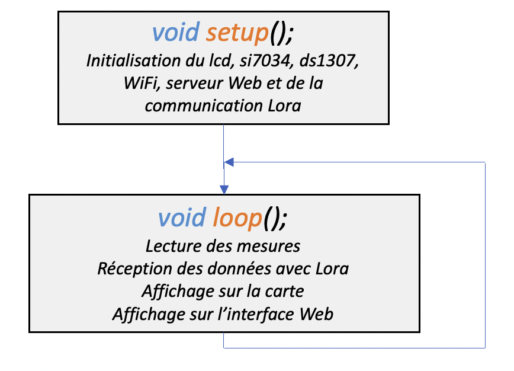
